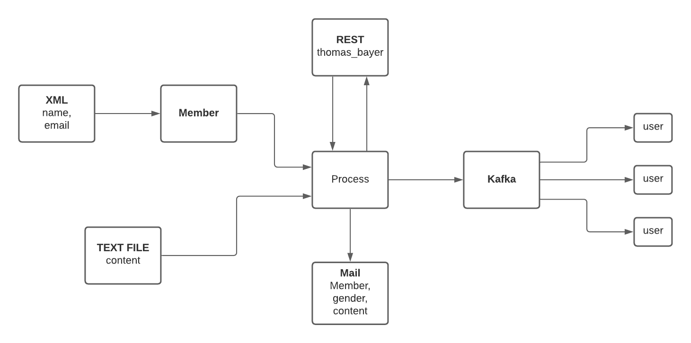

### Mini Project 2: Message-Oriented Middleware

**Participants**

    * Morten Feldt
    * Nur Salem
    * Jörg Oertel

**Technology used**

    * Apache Kafka
    * Read a list of members from XML file
    * Read content of message from text file
    * REST is used for connecting to Thomas-Bayer API

**Userguide**

   1. start zookeeper
   2. start Kafka server
   3. create "mesageTopic"
      * bin/kafka-topics.sh --create --zookeeper localhost:2181 --replication-factor 1 --partitions 1 --topic messageTopic
   4. run spring boot project at http://localhost:8081

**Flow of the project**

## Assignment 3:  Mail Services

Create a messaging application, which sends notification letters to a group of people at a specified time, under the following conditions: 

    1.The names and mail addresses of the group members are stored in either xml or json file. 
    2.The content of the letter is stored in a text file.
    3.The letter should start with the salutation “Dear XX NN,”, where -XX is either ‘Mr’ or ‘Ms’, depending on the gender of the receiver; -NN is the name of the receiver. 

The gender of the receiver can be discovered by use of a web service, hosted at ->

http://www.thomas-bayer.com/restnames/ 

##
